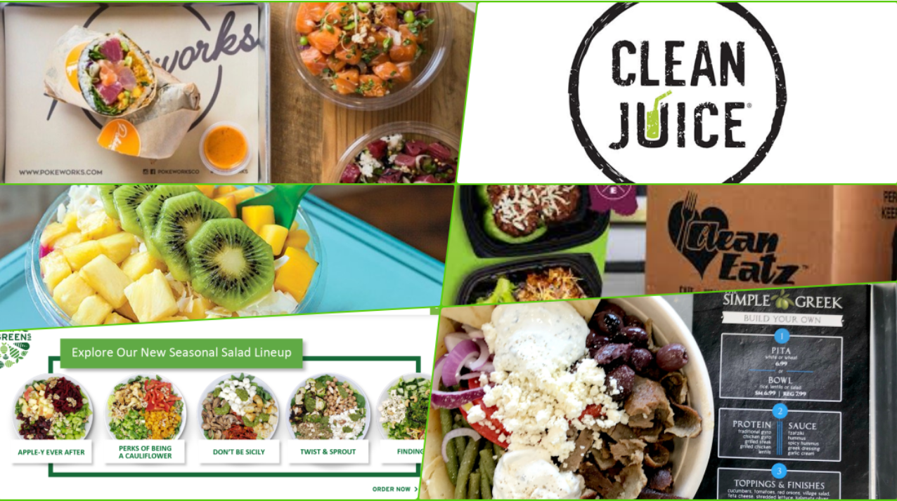

# Restaurants Sales Analysis

## Chao Gao

Git-hub repository at: 
https://github.com/Chaoccz/RestaurantsSalesAnalysis

- Jupyter notebook: **Restaurants Sales During COVID.ipynd**
- Data Set: Top250.csv, Independence100.csv, Future50.csv, Food_Supply_Quantity_kg_Data.csv

  

# Table of contents
1. [Introduction](#introduction)

2. [Feature Engineering](#sec2)
     1. [Null Values Checking](#sec2p1)
     2. [Renaming Columns, Casting](#sec2p2)
     3. [Making Category Feature](#sec2p3)

3. [EDA Data Visualization](#sec3)
     1. [Year on Year Distribution](#sec3p1)
     2. [Correlation with Sales](#sec3p2)
     3. [Year on Year Sales Indicator](#sec3p3)
     4. [Restaurant Category and Sub Category](#sec3p4)
     5. [Category Sales Indicator](#sec3p5)

4. [Top Resturants in Best Category](#sec4)
     1. [Pizza](#sec4p1)
     2. [Burger](#sec4p2)
     3. [Varied Menu](#sec4p3)
     4. [Family](#sec4p4)
     5. [Meat](#sec4p5)
     6. [Mexican](#sec4p6)
     7. [Cafe](#sec4p7)
     8. [Sandwich](#sec4p8)
     9. [Chicken](#sec4p9)
     10. [Drinks](#sec4p10)

5. [Top 50 Future Restaurants](#sec5)
     1. [Overview](#sec5p1)
     2. [Franchising Or Not](#sec5p2)
     3. [Franchising Or not/Sales](#sec5p3)
     4. [Correlation with YoY Sales](#sec5p4)

6. [Relationship between Diet and Corona](#sec6)
     1. [Correlation](#sec6p1)
     2. [Confirmed Cases and Veg products](#sec6p2)
     3. [Vegan vs Animal](#sec6p3)
     4. [PairGrid](#sec6p4)

7. [Conclusion](#sec7)

## 1. Introduction 
The data was obtained by means of web scraping, i.e. data download with the use of programming code based on the website code. In this case, the "rvest" package from the R programming language was used along with the "SelectorGadet" browser add-on to facilitate work with the website.

The data was downloaded from www.restaurantbusinessonline.com on January 30, 2021 with three plants describing 3 rankings: top 250, top 100 indenents and future 50 thus creating 3 tables, where the restaurant is described by several variables in each row.

The data can be used to tell the story of what 2020 was like for restaurants, what was hot, what could be more popular soon, or what the difference is between large companies and smaller businesses. I am curious what useful information can be obtained from this data!

We will try through theses datasets to know how restaurants act during Covid-19, what makes difference with sales during covid, peoples food behaviour during 2020 and how it's affecting on future restaurants

## 2. Feature Engineering 
### 2.1 Null Values Checking 
