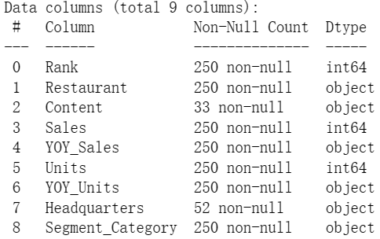

# Restaurants Sales Analysis

## Author: Chao Gao

Git-hub repository at: 
https://github.com/Chaoccz/RestaurantsSalesAnalysis

- Jupyter notebook: **Restaurants Sales During COVID.ipynd**
- Data Set: Top250.csv, Independence100.csv, Future50.csv, Food_Supply_Quantity_kg_Data.csv

  

# Table of contents
1. [Introduction](#introduction)

2. [Feature Engineering](#sec2)
     1. [Null Values Checking](#sec2p1)
     2. [Renaming Columns, Casting](#sec2p2)
     3. [Making Category Feature](#sec2p3)

3. [EDA Data Visualization](#sec3)
     1. [Year on Year Distribution](#sec3p1)
     2. [Correlation with Sales](#sec3p2)
     3. [Year on Year Sales Indicator](#sec3p3)
     4. [Restaurant Category and Sub Category](#sec3p4)
     5. [Category Sales Indicator](#sec3p5)

4. [Top Resturants in Best Category](#sec4)
     1. [Pizza](#sec4p1)
     2. [Burger](#sec4p2)
     3. [Varied Menu](#sec4p3)
     4. [Family](#sec4p4)
     5. [Meat](#sec4p5)
     6. [Mexican](#sec4p6)
     7. [Cafe](#sec4p7)
     8. [Sandwich](#sec4p8)
     9. [Chicken](#sec4p9)
     10. [Drinks](#sec4p10)

5. [Top 50 Future Restaurants](#sec5)
     1. [Overview](#sec5p1)
     2. [Franchising Or Not](#sec5p2)
     3. [Franchising Or not/Sales](#sec5p3)
     4. [Correlation with YoY Sales](#sec5p4)

6. [Relationship between Diet and Corona](#sec6)
     1. [Correlation](#sec6p1)
     2. [Confirmed Cases and Veg products](#sec6p2)
     3. [Vegan vs Animal](#sec6p3)
     4. [PairGrid](#sec6p4)

7. [Conclusion](#sec7)

## 1. Introduction 
The data was obtained by means of web scraping, i.e. data download with the use of programming code based on the website code. In this case, the "rvest" package from the R programming language was used along with the "SelectorGadet" browser add-on to facilitate work with the website.

The data was downloaded from www.restaurantbusinessonline.com on January 30, 2021 with three plants describing 3 rankings: top 250, top 100 indenents and future 50 thus creating 3 tables, where the restaurant is described by several variables in each row.

The data can be used to tell the story of what 2020 was like for restaurants, what was hot, what could be more popular soon, or what the difference is between large companies and smaller businesses. I am curious what useful information can be obtained from this data!

We will try through theses datasets to know how restaurants act during Covid-19, what makes difference with sales during covid, peoples food behaviour during 2020 and how it's affecting on future restaurants

## 2. Feature Engineering 
In this section, I will be doing **Feature Engineering** on the dataset. That includes Adding, Deleting, Combining, Mutating and Handling missing data. Here is a brief information of the dataset: 

### 2.1 Null Values Checking 
As we can see, there's no missing values in the dataset:

### 2.2 Renaming Columns, Casting 
I renamed Units to Branches, Segment_Category to sub_category, Converted percentags(YOY_Sales, YOY_Units) to floats, Checked there is no independence restaurant in top 250:

### 2.3 Making Category Feature
I made a new column called category according to the column sub_category, that way, the category is more concise and accurate:

## 3. EDA Data Visualization 
In this section, we will try to figure out what happend to Top Resturants Sales During 2020 and Extracting Imformative insights
### 3.1 Year on Year Distribution 
These Distributions shows us that year on year sales percentage no more than 40%:

### 3.2 Correlation with Sales 
Sales High Correlated with Branches: 

### 3.3 Year on Year Sales Indicator 
Although the restaurants were on the best list during the year, about 35% of restaurants had negative indicators:

### 3.4 Restaurant Category and Sub Category 
Sunburst shows that quick-service subcategory always get high sales:

### 3.5 Category Sales Indicator 
Varied menu, sandwiches and sports bar had negative indicators more than positive:

## 4. Top Resturants in Best Category 
In this section, we will continue exploring top resturants in each categories using EDA

### 4.1 Pizza 

### 4.2 Burger 

### 4.3 Varied Menu 

### 4.4 Family 

### 4.5 Meat 

### 4.6 Mexican 

### 4.7 Cafe 

### 4.8 Sandwich 

### 4.9 Chicken 

### 4.10 Drinks 

## Insights

1. Number Branches is The Highest Correlated With Sales
2. 35% YOY for Top Restaurants are Negative
3. Burger Restaurants is the highest Sales in 2020
4. Quick Service is an optimal solution to get high sales
5. Sports Bar and Sandwich Restaurants face Big losses

## 5. Top 50 Future Restaurants 
In this section, we will explore the top 50 future restaurants and extract information from the plots

### 5.1 Overview 
Here is a brief information of the dataset:

### 5.2 Franchising Or Not 
58% of the restaurants are a franchise, and 42% are not a franchise:

### 5.3 Franchising Or not/Sales 
Restaurants that are a franchise have more sales than non-franchise ones:

### 5.4 Correlation with YoY Sales 
Year on Year Sales is not highly correlated with other attributes:

## 6. Relationship between Diet and Corona  
**Is diet Related to your Infection with Corona?** 

Now we are trying to find if there is a relationship between some food products and the high rates of infection with the Coronavirus

### 6.1 Correlation 

### 6.2 Confirmed Cases and Veg products 
we will notice here the negative correlation between confirmed cases and veg_product:

### 6.3 Vegan vs Animal 
We note here that vegan products have an inverse relationship with the number of Confirmed cases (-0.5) , unlike animal products(+0.6), and this is a logical explanation for why evergreens restaurant was the most increase in sales rates during the Corona pandemic:

### 6.4 PairGrid 

## 7. Conclusion 
1. During The corona pandemic, The Most were eating organic food
2. Restaurants That rely on gatherings have faced significant losses
3. Number of branches forms a big difference in sales, it helps to provide Quick Services
4. It is worth relying on franchising for its high potential in achieving high sale
5. Going Vegan Can Reduce Severity Of COVID-19

